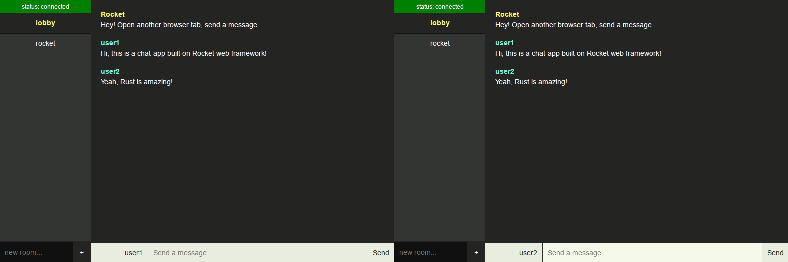

# rocket-chat-app

[Rocket](https://rocket.rs/) is a web framework for Rust that makes it simple to write fast, secure web applications without sacrificing flexibility, usability, or type safety.

The project consists of a simple chat application.

# Use

Run the server:
```
cargo run
```

For a better experience open two browsers and access the follow endpoint:
```
http://127.0.0.1:8000
```




## Dependencies

- [Rocket](https://crates.io/crates/rocket/0.5.0-rc.1)
- [Rand](https://crates.io/crates/rand)
